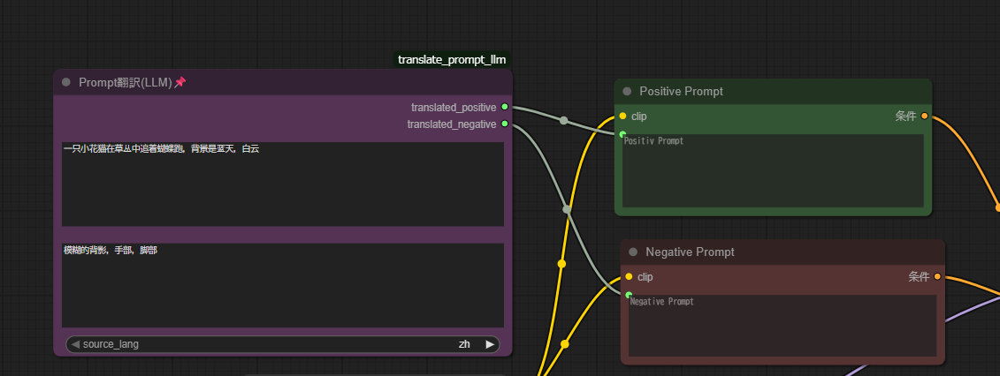

# An extention For ComfyUI

Base on  
** ComfyUI: Ver 0.3.39. **  
** Bootstrap 5.3 **  

## Description
Minimal & Simple extention for ComfyUI.
Using LLM to translate prompt into English.
Default Using Model [Google gemini-2.0-flash].
Should SETUP API-KEY in [translate_config.json] FIRST!.

screenshot 


## MEMO
The reason to create this plugin:
CAUSE "NODE_CLASS_MAPPINGS" ERROR like :
```txt
module for custom nodes due to the lack of NODE_CLASS_MAPPINGS. 
``` 

The KEY POINT is :
1. CREATE __init__.py file.
2. PUT following CODE to the file.
```python
from .translate_prompt import NODE_CLASS_MAPPINGS, NODE_DISPLAY_NAME_MAPPINGS
__all__ = ['NODE_CLASS_MAPPINGS', 'NODE_DISPLAY_NAME_MAPPINGS']
```